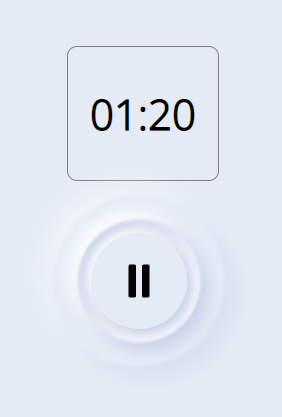
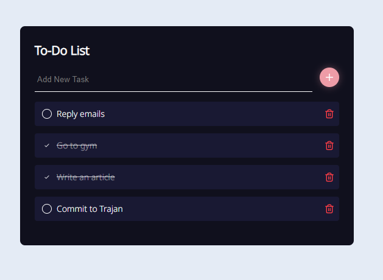
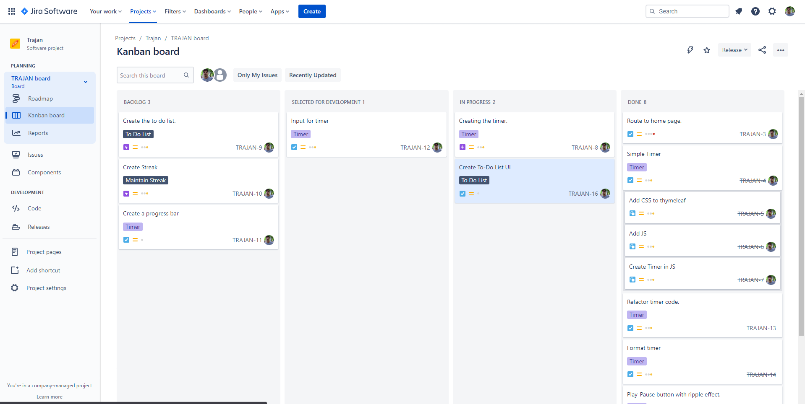

[GitHub repo](https://github.com/Atul-Bhatt/Trajan)

## Introduction
Trajan is a productivity app named after the Roman emperor who followed Nerva and is considered one of the most productive Roman emperors. It seemed fit to name this productivity app after him.
I'm an extensive user of productivity apps. Making lists, timing my tasks and trying to keep consistency is important to make most of your time. There are apps that provide these functionalities but I wanted to put all these in one place, hence, I created Trajan.

## Features

Trajan consists of three main features - Timer, To-Do list and a Stream Counter. To-Do list and timer are still in development while streak counter hasn't been picked for development yet.

### Timer

Timer for the app is as simple as it could've been which is easy on the eyes. The play-pause button for the timer does contain some animation. While the timer is playing, a circular wave ripples outwards, when the timer is paused or finished the ripple animation stops.

### To-Do List

To-Do list gives you functionality of adding a new task, striking through a task (completed task) and deleting a task (removed from the list).

### Streak Counter

Duolingo has a streak counter. I've used the app and love the fact that people don't like breaking streaks, as the streak grows the commitment grows with it. The streak counter will keep track of how many continuous days you have done a particular task. This feature has not been picked up for development yet.

## Kanban board for Trajan

I'm a member of r/programming subreddit and one day while surfing through it, I found a post mentioning why it's hard to finish personal projects. The most upvoted comment said it's because we do the fun stuff first and don't bother with the boring stuff.
To not fall in this trap, I started using a Kanban board to break down tasks and pick them up one at a time so as not to be overwhelmed by all the features and not to not quit the project halfway through development. So far, it has been a great help.

